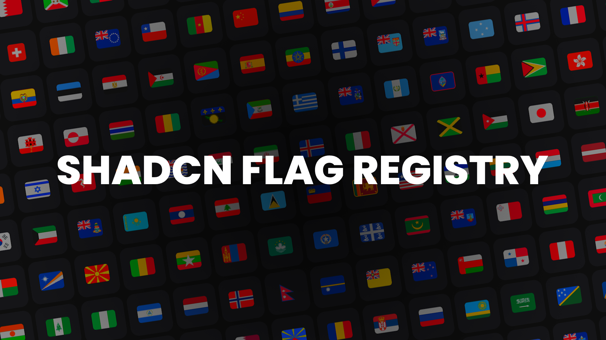

# Shadcn Flag Registry

This registry enables you to use fast and maintained flags from a single React component. The flags were adopted from [twemoji](https://github.com/twitter/twemoji) which currently is unmaintained. They have been updated according to the latest state of the [United Nations Member State List](https://www.un.org/en/about-us/member-states). It also includes some territory ones, giving you a total of 252 flags.

### Installation

- `bunx --bun shadcn@latest init`
- `bunx --bun shadcn@latest add https://shadcn-flags.vercel.app/r/registry.json`

### Usage

It has a `code` prop which takes a country's [ISO-3166-2 Code](https://en.wikipedia.org/wiki/ISO_3166-2#Current_codes) and it also takes React SVG Component Props (width, height, etc.) For example:

If you want to render Hungary's flag: `<Flag code={"hu"} .../>` it will result in something like this:

<svg xmlns="http://www.w3.org/2000/svg" viewBox="0 0 36 36" width="100px" height="100px"><path fill="#EEE" d="M0 14h36v8H0z"/><path fill="#CD2A3E" d="M32 5H4C1.791 5 0 6.791 0 9v5h36V9c0-2.209-1.791-4-4-4z"/><path fill="#436F4D" d="M4 31h28c2.209 0 4-1.791 4-4v-5H0v5c0 2.209 1.791 4 4 4z"/></svg>

### Flexibility

If you ever feel like you need to modify a flag to adapt to even the latest political changes you can do that by editing the `/lib/flags.tsx` file (if you are using the default config) which stores all the flags as svgs.

### SVG Files

If you need the svgs as files navigate to the `/public/flags/` in the repo or [here](https://github.com/vorhdam/flags/tree/main/public/flags). They are all uniform 36x36 viewBox svgs.
